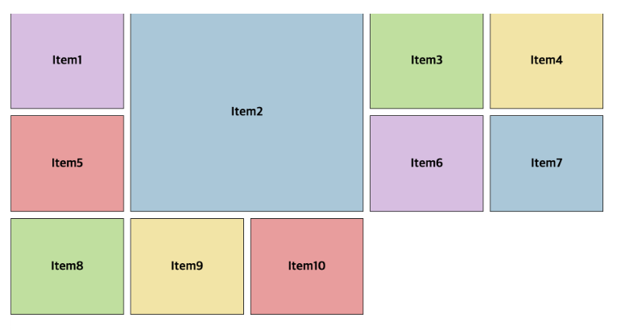
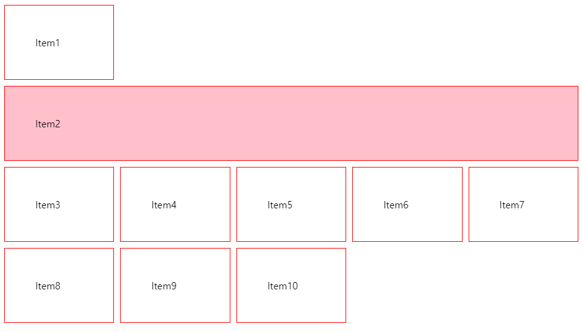

# Basic-Calculator


## 기능
사칙연산 계산기 
<br>

## 학습
### 1. css :  grid  
: CSS grid 레이아웃은 웹페이지를 위한 이차원 레이아웃 시스템     

  

<br>

: 하나의 grid은 대게 **columns, rows**로 구성되며, 각 행과 열 사이에 공백이 있는데, 대게는 이를 일컬어 **gutters**라고 부릅니다.  

<br>
: ex_200px 열 3개 추가  

<br>  

```
.container {
  display: grid;
  grid-template-columns: 200px 200px 200px;
}
```


: **fr 단위를 사용하여 그리드 행과 열을 가변적으로 조정**할 수 있습니다. fr 단위는 그리드 컨테이너에서 그리드 행과 열의 크기를 유연하게 조정할 수 있는 사용 가능한 공간의 한 분율을 나타냅니다.
<br>    

```
.container {
  display: grid;
  grid-template-columns: 2fr 1fr 1fr;
}
```


<br>

: 트랙 사이 간격   
- 길이 단위 또는 백분율이 될 수 있지만, fr 단위는 될 수 없습니다.  
- column-gap :  열 사이의 간격  
- row-gap : 행 사이의 간격   
- grid-gap : 열과 행 모두의 약어  
```
.container {
  display: grid;
  grid-template-columns: 2fr 1fr 1fr;
  grid-gap: 20px;
}
```


: 트랙 목록의 반복  
- 트랙 목록의 전체 또는 일부 섹션만 반복  
```
.container {
  display: grid;
  grid-template-columns: repeat(3, 1fr);
  grid-gap: 20px;
}
```

: grid-column, grid-row  
- grid-column 이나 grid-row 를 사용하면 각각 아이템들이 독립적으로 어디까지 크기와 높이를 가질 건지 결정 할 수 있다.
```
  .item2 {
    grid-column: 2 / 4;  // 2번째 column 줄부터 4번째 줄까지 차지
    grid-row: 1 /3;      // 1번째 row 줄부터 3번째 줄까지 차지
  }
```
  

- 한 줄을 다 차지하게 할 때 

```
  .item2 {
       grid-column: 1 / -1;
  }
```


- span   
: 위치를 정해주지 않고 상대적으로 자식 그리드의 크기만 설정할 때
```
  .item2 {
    grid-column: span 2; // 가로로 두 그리드 차지
  }
```
   

```
  .item2 {
    grid-row: span 2; // 세로로 두 그리드 차지 
  }
```  


 
### 2. js : eval()  
: 문자열을 코드로 인식하게 하는 함수  

```
  var jb = '2+2';
  document.write( '<p>' + jb + '</p>' ); // 2+2
  document.write( '<p>' + eval( jb ) + '</p>' );  // 4
```

## 학습출처
**유튜브**   
https://www.youtube.com/@JavaScriptKing   

**css**      
https://developer.mozilla.org/  
https://www.w3schools.com/  
https://velog.io/@brgndy/CSS-grid-%EC%86%8D%EC%84%B1-%EC%A0%95%EB%A6%AC#-grid-column-grid-row  
https://saeatechnote.tistory.com/entry/css-grid-%EC%84%B8%EC%83%81%EC%97%90%EC%84%9C-%EA%B0%80%EC%9E%A5-%EC%89%BD%EA%B2%8C-%EC%9D%B4%ED%95%B4%ED%95%98%EA%B8%B0

**js**  
https://www.codingfactory.net/11024  


**키워드**  
: grid   
: eval  
